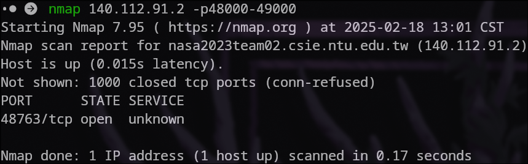

# NASA Homework 0

林靖昀

## Network Administration

### 1. Short Answer

* **P1**
    From layer 5 to 1:  
    * **Application layer:**
    Provides an interface and protocols/services for applications to use.
    Example:
    A web browser and a web server communicating with the HTTP protocol.
    * **Transport layer:**
    Segments the data through two main protocols, TCP / UDP, provides multiplexing through ports and reliable data transfer(TCP).  
    Example:
    HTTP using TCP's service to ensure a connection.
    * **Network layer:**
    Packs segments(or UDP datagrams) into IP datagrams, then routes the data to the destination.
    Example:
    TCP using IP to route to a destination.
    * **Data link layer:**
    Frames the data, and defines protocols on how data is sent from device to device.
    Example:
    Using ARP to discover the MAC address associated with the IP address. 
    * **Physical layer:**
    In charge of turning digital data into a format that can be sent over different physical medias.
    Example:
    Data being translated into radio wave signals to be transferred over wifi.  

    **Reference:**
    **Computer Networking A Top-Down Approach**

<div style="page-break-after: always;"></div>

* **P2**  
    1.  VLANs are the logical separation of a physical network, allowing us to create virtual LANs. It abstracts out the physical layout of the network and allows us to group and design different virtual networks regardless of the underlying network layout.  

    2.  **Switch:**  
        Forwards data between the devices connected directly  to it, enabling communication between those devices.  A switch operates at layer 2 in the TCP/IP model. It provides direct link access with MAC addresses.  
        **Router:**  
        Forwards data between the networks connected to it, providing routing between different networks. With different protocols, routers route data over an optimal path over the internet.  A router operates at layer 3 in the TCP/IP model. It provides inter-network communication while implementing routing.  

    3.  **Broadcast storm:**  
        A Broadcast storm is the accumulation of broadcast messages on a networks bandwidth,commonly caused by infinitely looping broadcast messages (from a switching loop.)  
        Prevention:  
        * Getting rid of switching loops via link aggregation or other techniques.  
        * Segmenting the broadcast domain physically or logically (with VLANs).  

        **Switching loop:**  
        A switching loop happens when there exists more than 1 path between 2 switches, thus forming a loop, allowing data to loop indefinitely.  
        Prevention:  
        * Using Link aggregation.  
        * Using the spanning tree protocol to build loop free logical networks.  

        Broadcast storms and switching loops are similar in that they both stem from infinitely looping data occupying the network, broadcast storms are different from switching loops as they are caused specifically by broadcast messages.

    **Reference:**  
    [https://en.wikipedia.org/wiki/VLAN](https://en.wikipedia.org/wiki/VLAN)  
    [https://en.wikipedia.org/wiki/Network_switch](https://en.wikipedia.org/wiki/Network_switch)  
    [https://en.wikipedia.org/wiki/Router_(computing)](https://en.wikipedia.org/wiki/Router_(computing))
    [https://en.wikipedia.org/wiki/Broadcast_storm](https://en.wikipedia.org/wiki/Broadcast_storm)
    [https://en.wikipedia.org/wiki/Switching_loop](https://en.wikipedia.org/wiki/Switching_loop)  

<br>
<!-- <div style="page-break-after: always;"></div> -->

* **P3**  
    1. Because there are not enough IPv4 addresses.  
    2. Considering the fact that IPv6 contains 340,282,366,920,938,463,463,374,607,431,768,211,456 addresses (128 bit address space), giving: “3,911,873,538,269,506,102 addresses per square meter of the surface of the planet Earth”, it is highly unlikely that we would need to change protocols because of insufficient addresses. That being said, this does not mean that there won't be changes to our internet protocol stack, the architecture of the internet might change in the future bringing new protocols.  
    3. The main difference is the address space size, other changes where also made in IPv6, like replacing TTL with hop limit, and defining a fixed header size. In IPv6, only the sender can perform fragmentation, while in IPv4, nodes along the route can fragment the data if needed.  
    4. Since a the internet was initially implemented on IPv4, a lot of old hardware and software are not built to support IPv6, transitioning between the two cannot be done instantly and needs to be slowly phased in.  

    **Reference:**  
    [https://www.ciscopress.com/articles/article.asp?p=2803866&seqNum=3](https://www.ciscopress.com/articles/article.asp?p=2803866&seqNum=3)
    [https://en.wikipedia.org/wiki/IPv6](https://en.wikipedia.org/wiki/IPv6)
    [https://en.wikipedia.org/wiki/IPv6_packet](https://en.wikipedia.org/wiki/IPv6_packet)
    [https://en.wikipedia.org/wiki/IPv4](https://en.wikipedia.org/wiki/IPv4)
    [https://www.geeksforgeeks.org/differences-between-ipv4-and-ipv6/#difference-between-ipv4-and-ipv6](https://www.geeksforgeeks.org/differences-between-ipv4-and-ipv6/#difference-between-ipv4-and-ipv6)

<br>

* **P4**  
    * **UDP**  
    UDP is connectionless protocol, it works by providing "best effort" service: sending data without establishing a connection before hand, allowing you to send data without needing to care if the other end is even available or not.  
    * **TCP**  
    TCP works by establishing a connection first, then sending data over, TCP provides reliable data transfer, deals with errors and packet loses, and provides congestion control.  

    TCP and UDP both provide multiplexing through ports.  TCP provide more services as listed above, while UDP provides bare bones best effort service.
    UDP is used when high latency cannot be tolerated, and reliable data transfer is not important (video streaming, online gaming, etc.)  
    TCP is used when transmission errors cannot be tolerated, and latency is not that important (SMTP)
    **Reference:**
    **Computer Networking A Top-Down Approach**  

<br>

* **P5**  
    EFK is a software stack consisting of Elasticsearch, Fluentd, and Kibana. Fluentd collects and unifies log data to Elasticsearch, which is a search engine. Kibana is a data visualization frontend dashboard for Elasticsearch.  
    EFK allows system admins to aggregate and process logging data of many distributed systems while also being scalable. This is suitable for our department, since we have many services running on multiple nodes, each having their own logs and data.  The main disadvantages of EFK are the overhead it brings, and the large amount of storage that is required to store the logs.  

    **Reference:**
    [https://platform9.com/blog/logging-monitoring-of-kubernetes-applications-requirements-recommended-toolset/](https://platform9.com/blog/logging-monitoring-of-kubernetes-applications-requirements-recommended-toolset/)  

<br>
<!-- <div style="page-break-after: always;"></div> -->

* **P6**  
    The multiplexing at layer 4 is the differentiation of different services on the same host, ports are used to multiplex and de-multiplex in this case.  
    Generally in networking, multiplexing is resource sharing between multiple hosts, 3 common types of multiplexing are:  
    1. Time-division multiplexing
    2. Frequency-division multiplexing
    3. Statistical multiplexing  

    The wifi in our department building likely uses FDM (or some variant of it), since wifi is transmitted over radio waves.  
    **Reference:**
    **Computer Networking A Top-Down Approach**  

<div style="page-break-after: always;"></div>

### 2. Command Line Utilities

* **P1**  
    1.  traceroutev results:  
        {height=75}  
    2.  ping results:  
        {height=120} nslookup results:  
        {height=120}  
    3.  From the reserved ip address ranges for private networks:  
        10.200.200.200 belongs to a private network.  
        140.112.4.126 and 140.112.5.178 belongs to the public network.  
    4.  traceroute works by sending probes with incrementing TTL, at each TTL, by default traceroute will send 3 probes, the 3 time values are the round trip time of each probe, if we change the amount of probes we send per TTL, the amount of time values we get will also change.  
        Later results might not always be larger, for example, if a later node has a better path back to us, the round trip time might add up to be smaller.  
    5.  Sequence diagram:  
        ```mermaid
        sequenceDiagram
        participant traceroute
        participant 10.200.200.200
        participant 140.112.4.126
        participant 140.112.5.178
        traceroute->>10.200.200.200: Send udp datagram (TTL=1)
        10.200.200.200-->>traceroute: ICMP TIME_EXCEEDED
        traceroute->>10.200.200.200: Send udp datagram (TTL=2)
        10.200.200.200->>140.112.4.126: Forward udp datagram (TTL=1)
        140.112.4.126-->>traceroute: ICMP TIME_EXCEEDED
        traceroute->>10.200.200.200: Send udp datagram (TTL=3)
        10.200.200.200->>140.112.4.126: Forward udp datagram (TTL=2)
        140.112.4.126->>140.112.5.178: Forward udp datagram (TTL=1)
        140.112.5.178-->>traceroute: icmp unreach port
        ```
    **Reference:**  
    traceroute man page

<div style="page-break-after: always;"></div>

* **P2**  
    1.  ping sends ICMP ECHO_REQUESTs.  
        ping results:  
        {height=75}  
    2.  nmap results:  
        {height=75}
        We see that ping is unable to get a response while nmap with the `-sn` option can, from nmaps man page:  
        > The default host discovery done with -sn consists of an ICMP echo request, TCP SYN to port 443, TCP ACK to port 80, and an ICMP timestamp request by default. When executed by an unprivileged user, only SYN packets are sent (using a connect call) to ports 80 and 443 on the target.  

        Using the `-vvv` option we see:  
        {height=180}
        We received a SYN-ACK, meaning the TCP SYN sent to port 80 / 443 gave us a response.  

    3.  Scan reults:  
        {height=165}  
        Service: http
        Version: nginx 1.26.2
        http is a request-response protocol used to transmit data over the web.  
        Command:  `nmap -p80 -sV 140.112.91.2`  
    
    4.  POST response:  
        {height=30} nmap scan results:  
        {height=120} netcat response:  
        {height=30}
    
    **Reference:**
    ping, nmap, and curl man pages.  

<div style="page-break-after: always;"></div>


* **P3**  
    1.  nslookup results:  
        {height=105}
        IP: 140.112.30.131  
    2.  nslookup results:  
        {height=75}
        Domain name: Starry.csie.ntu.edu.tw  
    3.  nslookup results:  
        {height=195}  
        TXT: "Your guitar is in the box"
    4.  dig results:  
        {height=375}
        CNAME: Gu1tArHer0.csie.ntu.edu.tw  
    
    **Reference:**
    nslookup & dig man pages
    [https://en.wikipedia.org/wiki/List_of_DNS_record_types](https://en.wikipedia.org/wiki/List_of_DNS_record_types)

<div style="page-break-after: always;"></div>

### 3. Basic Wireshark
* **P1**   
    1.  Port 3000
    2.  We see multiple ACKS from port 3000 after SYN was sent to it, we also see that port 3000 receives HTTP requests, and sends back HTTP responses.  
    3.  I/O throughput graph:  
        
    4.  Highest transmission speed: 1.268MB/s
        Time: 2.837 (second)
    5.  29, search with filter with 'http.request.method == "GET"'.
    6.  There is a POST request to "/dashboard/invoices/create"  
        Data in customer ID field:33393538646339652d373132662d343337372d383565392d666563346236613634343261

    **Reference:**  
    [https://www.wireshark.org/docs/wsug_html_chunked/ChStatIOGraphs.html](https://www.wireshark.org/docs/wsug_html_chunked/ChStatIOGraphs.html)

<br>

* **P2**  
    1.  1. Go to Edit>Preferences.
        2. In the protocols drop down menu on the left, select TLS.  
        3. Edit RSA keys list.
        4. Set IP to 127.0.0.1, port 443, and select private key file.  
    2.  Packet number 32.  
        1. Go to File>Export Objects>HTTP.
        2. Save image.
        Image:  
          

    **Reference:**  
    [https://my.f5.com/manage/s/article/K19310681](https://my.f5.com/manage/s/article/K19310681)
    [https://osqa-ask.wireshark.org/questions/35123/fastest-way-to-display-a-png-file/](https://osqa-ask.wireshark.org/questions/35123/fastest-way-to-display-a-png-file/)

<div style="page-break-after: always;"></div>

### 4. Cryptography  

* **P1**  
    1.  **Flag:**  NASA_HW0{1_10V3_r54}  
    2.  Process:  
        1.  Generate key
        2.  Receive encrypted
        3.  Decrypt with CRT:
            $d_p = d \mod (p - 1)$
            $d_q = d \mod (q - 1)$
            $q_{inv} = q^{-1} \mod p$
            $m_1 = c^{d_p} \mod p$
            $m_2 = c^{d_q} \mod q$
            $h = (q_{inv}(m_1 - m_2)) \mod p$
            $m = m_2 + h \times q$  
        4.  Convert decrypted int into bytes then into text.  

    Python code:  
    ```python
    from pwn import *
    from Crypto.PublicKey import RSA

    key = RSA.generate(4096)
    target = remote("140.112.91.1", 48763)

    print(target.recvuntil("n: "))
    target.sendline(str(key.n))

    print(target.recvuntil("e: "))
    target.sendline(str(key.e))

    print(target.recvline())
    print(target.recvuntil(": "))
    secret = int(target.recvall()[:-1])
    secret = int(secret)

    dp = key.d % (key.p - 1)
    dq = key.d % (key.q - 1)
    qinv = pow(key.q, -1, key.p)
    m1 = pow(secret, dp, key.p)
    m2 = pow(secret, dq, key.q)

    h = (qinv*(m1 - m2)) % key.p
    m = m2 + h * key.q

    m = m.to_bytes(m.bit_length() // 8 + 1).decode()
    print(m)
    ```  

    **Reference:**  
    [https://en.wikipedia.org/wiki/RSA_(cryptosystem)](https://en.wikipedia.org/wiki/RSA_(cryptosystem))
    [https://guyinatuxedo.github.io/02-intro_tooling/pwntools/index.html](https://guyinatuxedo.github.io/02-intro_tooling/pwntools/index.html)
    [https://pycryptodome.readthedocs.io/en/latest/src/public_key/rsa.html](https://pycryptodome.readthedocs.io/en/latest/src/public_key/rsa.html)

<div style="page-break-after: always;"></div>

### 5. 為什麼簽不了憑證？？？  

* **P1**  
    A subnet is a logical division of an IP network, usually represented by partitioning the ip address into a subnet id and a host id.  
    **Reference:**  
    [https://en.wikipedia.org/wiki/Subnet](https://en.wikipedia.org/wiki/Subnet)
* **P2**  
    Gateways are software or hardware that support multiple protocols in order to connect different networks together, they can operate at all 7 layers of the OSI model.
    **Reference:**  
    [https://en.wikipedia.org/wiki/Gateway_(telecommunications)](https://en.wikipedia.org/wiki/Gateway_(telecommunications))
* **P3**  
    X -> WAN -> A1  
    **Reference:**  
    [https://en.wikipedia.org/wiki/Default_gateway](https://en.wikipedia.org/wiki/Default_gateway)
* **P4**  
    If machine A has a route specification that points to X through A1:
    A1 -> WAN -> X  
    Otherwise:  
    A2 -> LAN -> B2 -> WAN -> X  
    **Reference:**  
    [https://en.wikipedia.org/wiki/Default_gateway](https://en.wikipedia.org/wiki/Default_gateway)
* **P5**  
    Stateful firewalls monitor packets by tracking the state of incoming network connections, while stateless firewalls monitor each package individually.  
    Stateful firewalls are more likely to block a TCP ACK without a SYN.  
    **Reference:**  
    [https://en.wikipedia.org/wiki/Stateful_firewall](https://en.wikipedia.org/wiki/Stateful_firewall)
    [https://www.checkpoint.com/cyber-hub/network-security/what-is-firewall/what-is-a-stateless-firewall/](https://www.checkpoint.com/cyber-hub/network-security/what-is-firewall/what-is-a-stateless-firewall/)
* **P6**  
    It seems that during the TCP handshake in step 2, X sends SYN which arrives at A1, A sends (SYN, ACK), which goes through the default gateway, since B is a stateful firewall, it blocks A's out going (SYN, ACK), as it hasn't seen an ACK beforehand. This means X never receives the (SYN, ACK) no matter how many times it tries, and thus cannot establish a TCP connection.  
* **P7**  
    1. System shutdown: 5 ~ 15 minutes depending on services and active connections.
    2. Certificate Update: 30 ~ 60 minutes, assuming we are talking about domain validation certificates, which are usually automatically validated.
    3. System restart and testing: 1 ~ 2 hours, to ensure all services are functional.  
    4. Grace period/overflow time: 1 ~ 2 hours, For when something goes wrong and we need more time to identify, fix or reschedule another system maintenance.  
    In total 6 hours.  

* **P8**  
    Remove A's A1 interface, and have it accept all data from its default gateway.  
    Add a route entry to A's route table that directly connects A1 to X through the WAN.  
* **P9**  
    Yes :3

<div style="page-break-after: always;"></div>

## System Administration

### 6. btw I use arch  

* **P0**  
    My installation of Arch was done in a proxmox VM, pre-installation steps:  
    1.  Set boot mode to OVMF (UEFI) in VM creation configuration.  
    2.  Enter firmware settings upon first boot.  
    3.  Disable secure boot.  

    Arch installation steps:  
    1.  Set the console keyboard layout and font  
        1. Use default keymap layout (US).  
        2. `setfont ter-132b` to increase font size.  
    2.  Verify the boot mode: `cat /sys/firmware/efi/fw_platform_size`.  
    3.  Verify internet connection: `ip link`.  
    4.  Update system clock.  
        1.  `timedatectl` shows that timezone is set to UTC +0000
        2.  Set time zone:  `timedatectl set-timezone Asia/Taipei`  
    5.  Partion disk.
        1.  `fdisk /dev/sda`.  
        2.  Create partition table `g`.  
        3.  Create partitions: `n`, default, default, `+Size`.  
        4.  Change partition types: `t`, type.  
        5.  Check changes: `p`.  
            {height=240}  
        6.  Write changes: `w`.  
    6.  Format partitions:  
        Root partition: `mkfs.ext4 /dev/sda1`.
        Home partition: `mkfs.ext4 /dev/sda2`.
        ESP: `mkfs.fat -F 32 /dev/sda3`.
        Swap partition: `mkswap /dev/sda4`.
    7.  Mount partitions:
        Root partition: `mount /dev/sda1 /mnt`.
        Home partition: `mount --mkdir /dev/sda2 /mnt/home`.
        ESP: `mount --mkdir /dev/sda3 /mnt/boot`.
        Swap partition: `swapon /dev/sda4`.  
    8. Install essential packages:  `pacstrap -K /mnt base linux linux-firmware networkmanager vim man-db man-pages texinfo`.  
    9.  Generate Fstab: `genfstab -U /mnt >> /mnt/etc/fstab`.  
    10. Chroot: `arch-chroot /mnt`.  

    <div style="page-break-after: always;"></div>

    11. Time:
        1. Set timezone: `ln -sf /usr/share/zoneinfo/Asia/Taipei /etc/localtime`.  
        2. generate `/etc/adjtime`: `hwclock --systohc`.  
    12. Localization:  
        1. Uncomment `en_US.UTF-8 UTF-8` in `/etc/locale.gen` and run `locale-gen`.  
        2. Create `locale.conf` with `LANG=en_US.UTF-8` inside.
        3. Use default us keymap.  
    13. Create and change hostname file: `/etc/hostname`.  
    14. Set root password: `passwd`.  
    15. Install GRUB:  
        1. Install packages: `pacman -S grub efibootmgr`  
        2. Grub-install: `grub-install --target=x86_64-efi --efi-directory=/boot --bootloader-id=GRUB`  
        3. Generate main configuration file: `grub-mkconfig -o /boot/grub/grub.cfg`  
    16. Reboot:
        1. `exit` chroot.  
        2. Unmount: `umount -R /mnt`
        3. `reboot`  
    17. Network setup:  
        Start `NetworkManager`: `systemctl enable NetworkManager`, `systemctl start NetworkManager`.  
        Add dns server: `resolvectl dns <interface> <dns-server>`.  
        Start `systemd-resolved`: `systemctl enable systemd-resolved`, `systemctl start systemd-resolved`.  
    18. Change font:
        1. Install `terminus-font`: `pacman -S terminus-font`.  
        2. Edit `/etc/vconsole.conf`: Add `FONT=ter-132b`
        3. Reload: `systemctl restart systemd-vconsole-setup`.  
    19. Add user: `useradd -m nasa`, and set password: `passwd nasa`  

    **Reference:**  
    [https://wiki.archlinux.org/title/Installation_guide](https://wiki.archlinux.org/title/Installation_guide)
    [https://wiki.archlinux.org/title/System_time](https://wiki.archlinux.org/title/System_time)
    [https://wiki.archlinux.org/title/Fdisk](https://wiki.archlinux.org/title/Fdisk)
    [https://man.archlinux.org/man/vconsole.conf.5.en](https://man.archlinux.org/man/vconsole.conf.5.en)
    [https://wiki.archlinux.org/title/Linux_console#Fonts](https://wiki.archlinux.org/title/Linux_console#Fonts)
    [https://wiki.archlinux.org/title/Users_and_groups#Example_adding_a_user](https://wiki.archlinux.org/title/Users_and_groups#Example_adding_a_user)  

<div style="page-break-after: always;"></div>

* **P1**  
    Hostname can be changed via: `hostnamectl set-hostname <hostname>`
    {height=30}  

<br>

* **P2**  
    {height=120}
    {height=120}
    **Reference:**  
    lsblk man page.  

<br>

* **P3**  
    {height=180}
    {height=30}

    **Reference:**  
    uname man page.  

<div style="page-break-after: always;"></div>

### 7. Flag hunting

* **P1**  
    1.  With `echo $HISTFILE`:  
        {height=30}  
        Path: `/home/nasa/kickstart.nvim/.git/logs/refs/remotes/origin/HEAD`  
    2.  With `export HISTSIZE=<number>`  
    3.  With `export HISTFILESIZE=<number>`  
    4.  Default history file:  
        {height=45}  
        In line 104 of new history file (using `less` and go to line x):
        {height=15}  
        **Flag:**  NASA{y0UF1nd+heCoRr3tFL4G}  

    **Reference:**  
    [https://datawookie.dev/blog/2023/04/configuring-bash-history/](https://datawookie.dev/blog/2023/04/configuring-bash-history/)  

<br>

* **P2**  
    From `./treasure`:  
    {height=135}  
    In `treasure-chest/`, with `sort -Sl`:  
    {height=105}  
    In line 418 in `treasure-chest/flag-962` (using `less` and go to line x):  
    {height=105}  
    **Flag:** NASA{EZ_TrEa$Ur3_HunT!}  

    **Reference:**  
    sort man page  

<div style="page-break-after: always;"></div>

* **P3**  
    With `./boss > tmp & pkill -P $!`:  
    {height=105}  
    **Flag:** NASA{m0dERn_Pr0B1em$_reQU1r3_m0dERn_SOluT10N5}  

    **Reference:**
    pkill man page
    [https://unix.stackexchange.com/questions/30370/how-to-get-the-pid-of-the-last-executed-command-in-shell-script](https://unix.stackexchange.com/questions/30370/how-to-get-the-pid-of-the-last-executed-command-in-shell-script)  

<br>

* **P4**  
    We can use two `grep`s to get the passcode:  
    {height=30}  
    {height=30}  
    **Flag:** NASA2025{n4ndeharuh1ka93yatt4n0}  

<br>

* **P5**  
    Find and check `tmux` config file:  
    {height=30}  
    {height=60}  
    We see that the prefix has been set to Ctrl-a.  
    After entering `tmux`, we can make the layout with the following series of commands:  
    1.  `Ctrl-a "` (Split horizontally)
    2.  `Ctrl-a %` (Split vertically)  
    3.  `Ctrl-a "` (Split horizontally)
    4.  `Ctrl-a %` (Split vertically) 
    5.  `Ctrl-a "` (Split horizontally)
    6.  `Ctrl-a %` (Split vertically)  

    Result:  
    {height=240}  

    **Reference:**  
    [https://wiki.archlinux.org/title/Tmux](https://wiki.archlinux.org/title/Tmux) 

<div style="page-break-after: always;"></div>

### 8. NASA 國的大危機  

* **P1**  
    `Dockerfile`:
    {height=420}
    `FROM python:3.9-slim`:  Specify the base image that we are building.  
    `RUN apt-get update && apt-get install -y ... && rm -rf /var/lib/apt/lists/*`: Update package manager and install packages, the `rm` is to remove files created by `apt-get update`, this is done to reduce the layer size.  
    `RUN mdkir -p /usr/libexec/run`: create directory.  
    `COPY usr/libexec/run/dist/transfer /usr/libexec/run/transfer`: Copies file into the filesystem.
    `COPY usr/libexec/run/run.sh /usr/libexec/run/run.sh`: Copies file into the filesystem.  
    `RUN chmod +x /usr/libexec/run/transfer`: Change the newly copied file into an executable.  
    `RUN chmod +x /usr/libexec/run/run.sh`: Change the newly copied file into an executable.  
    `CMD ["/usr/libexec/run/run.sh"]`: Sets the script `run.sh` to run when launching the build image.  

    **Reference:**  
    [https://docs.docker.com/reference/dockerfile/](https://docs.docker.com/reference/dockerfile/)
    [https://docs.docker.com/get-started/docker-concepts/building-images/understanding-image-layers/](https://docs.docker.com/get-started/docker-concepts/building-images/understanding-image-layers/)
    [https://askubuntu.com/questions/179955/var-lib-apt-lists-is-huge](https://askubuntu.com/questions/179955/var-lib-apt-lists-is-huge)
    [https://linux.die.net/man/8/apt-get](https://linux.die.net/man/8/apt-get)
    [https://opensource.com/article/20/5/optimize-container-builds](https://opensource.com/article/20/5/optimize-container-builds)  

<div style="page-break-after: always;"></div>

* **P2**  
    `docker images`:  {height=45}  
    `docker run <ID>`:  {height=30}  
    Check `run.sh`:  {height=195}
    Set environmental variable with `-e VAR=value`:  {height=60}  

    **Reference:**  
    docker man page & docker --help
    [https://docs.docker.com/compose/how-tos/environment-variables/set-environment-variables/](https://docs.docker.com/compose/how-tos/environment-variables/set-environment-variables/)  

<br>

* **P3**  
    Rerun image in background with `-d` flag:  
    {height=30}  Get container id:  
    {height=30}  Enter container with `docker exec -it <ID> /bin/bash`:  
    {height=30}  Use `tcpdump -i any -nn -A` to sniff packets and show packet contents:  
    {height=150}
    **Flag:**  
    flag[I'll send our killer on 3948/02/22]  

    **Reference:**  
    docker man page & docker --help  
    [https://docs.docker.com/reference/cli/docker/container/exec/](https://docs.docker.com/reference/cli/docker/container/exec/)  
    tcpdump man page  
    [https://opensource.com/article/18/10/introduction-tcpdump](https://opensource.com/article/18/10/introduction-tcpdump)