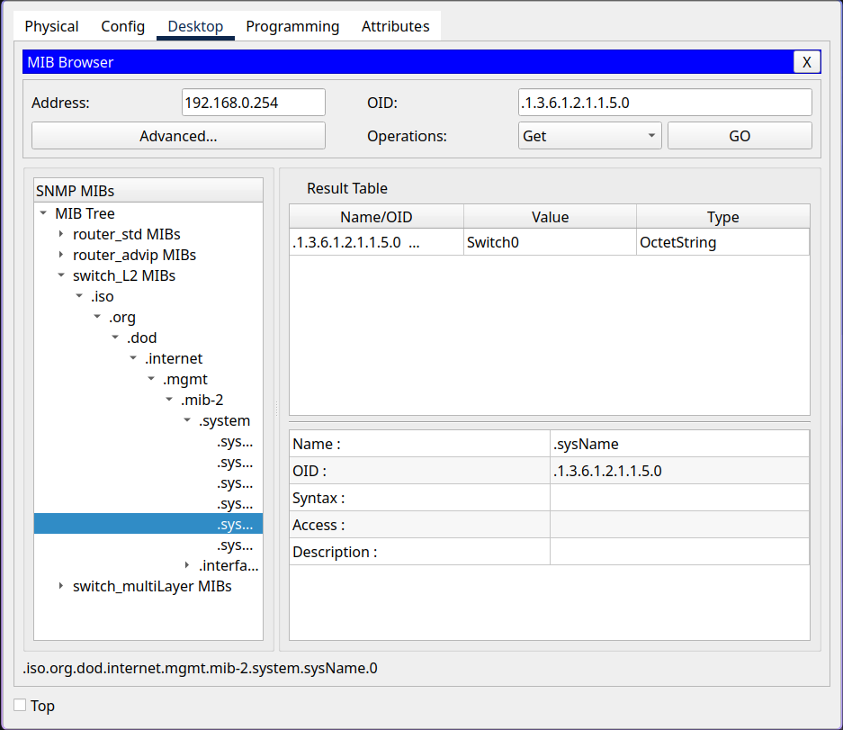

# NASA Homework 2

B12902116 林靖昀  

### Classmates consulted

**B12902118 金哲安**

### 1. 問答題

1. Dynamic ARP Inspection (DAI) works by validating each ARP request and response against a trusted database. The trusted database is constructed at runtime with DHCP snooping.  

    **Reference:**  
    [https://www.cisco.com/c/en/us/td/docs/switches/lan/catalyst4500/12-2/25ew/configuration/guide/conf/dynarp.html](https://www.cisco.com/c/en/us/td/docs/switches/lan/catalyst4500/12-2/25ew/configuration/guide/conf/dynarp.html)
    [https://en.wikipedia.org/wiki/DHCP_snooping](https://en.wikipedia.org/wiki/DHCP_snooping)  

 

2.  1. Access ports will only forward and receive data from one VLAN, whereas trunk ports allow multiple VLANs to share the same link.  
    2. Trunk native is the native VLAN associated with a trunk port, all untagged traffic received on that port is sent to the native VLAN, and all traffic tagged with the native VLAN are sent untagged.  
        Trunk natives will be useful when we need backward compatibility. For example, if we have old devices that do not support the 802.1Q protocol, with trunk natives, these devices can still use the network through the native VLAN.  
    3. VTP works by propagating VLAN settings across the network, configuring a new VLAN on a VTP server will distribute the settings for that VLAN to all switches in the domain.  
        Advantage:  
        Reduces administration.  
        Ensures consistency across devices.  
        Disadvantages:  
        The nature of VTP poses some risks, for example:  
        Since by default, a new switch is configured as a VTP server, if the new device has the correct VTP domain name and password, but has a higher revision number, it will overwrite and destroy all the current settings on the entire VTP domain.  

    **Reference:**  
    [https://www.networkacademy.io/ccna/ethernet/trunk-native-vlan](https://www.networkacademy.io/ccna/ethernet/trunk-native-vlan)
    [https://community.cisco.com/t5/switching/why-native-vlan-exists-on-a-trunk/td-p/1363872](https://community.cisco.com/t5/switching/why-native-vlan-exists-on-a-trunk/td-p/1363872)
    [https://www.cisco.com/c/en/us/support/docs/lan-switching/vtp/10558-21.html](https://www.cisco.com/c/en/us/support/docs/lan-switching/vtp/10558-21.html)
    [https://en.wikipedia.org/wiki/VLAN_Trunking_Protocol](https://en.wikipedia.org/wiki/VLAN_Trunking_Protocol)  

3.  1. Link aggregation does not split individual packets to send them on all links simultaneously, packets from the same connection are still sent on one link, thus the transmission speed does not increase.  
    2. Active mode will initiate link aggregation negotiations with others by sending LACP packets.  
        Passive mode will only respond to LACP packets, but does not actively send them.  
    3. The two switches will never form a port channel since neither side ever starts the LACP negotiation.  

    **Reference:**  
    [https://en.wikipedia.org/wiki/Link_aggregation](https://en.wikipedia.org/wiki/Link_aggregation)  
    [https://www.cisco.com/c/en/us/td/docs/ios/12_2sb/feature/guide/gigeth.html](https://www.cisco.com/c/en/us/td/docs/ios/12_2sb/feature/guide/gigeth.html)  

 

4.  1. STP works by build a spanning tree across the network, and disabling all link that aren't part of the spanning tree, this ensures that no loops exists, and that there are is only a single active path between any two hosts on the network.  
    2. Disabled, Blocking, Listening, Learning, Forwarding.
    **Reference:**  
    [https://en.wikipedia.org/wiki/Spanning_Tree_Protocol](https://en.wikipedia.org/wiki/Spanning_Tree_Protocol)  
    [https://documentation.meraki.com/MS/Port_and_VLAN_Configuration/Spanning_Tree_Protocol_(STP)_Overview](https://documentation.meraki.com/MS/Port_and_VLAN_Configuration/Spanning_Tree_Protocol_(STP)_Overview)

### 2. 真好，又有新的 switch 可以玩了：）

1.  `Switch(config)# hostname Switch1` on Switch1 and `Switch(config)# hostname Switch2` on Switch2.  

    **Reference:**  
    [https://www.cisco.com/c/en/us/support/docs/switches/catalyst-6000-series-switches/10581-6.html](https://www.cisco.com/c/en/us/support/docs/switches/catalyst-6000-series-switches/10581-6.html)  

 

2.  `Switch1/2(config)# enable secret enable`

    **Reference:**  
    [https://www.cisco.com/E-Learning/bulk/public/tac/cim/cib/using_cisco_ios_software/cmdrefs/enable_password.htm](https://www.cisco.com/E-Learning/bulk/public/tac/cim/cib/using_cisco_ios_software/cmdrefs/enable_password.htm)
    [https://www.cisco.com/c/en/us/support/docs/security-vpn/remote-authentication-dial-user-service-radius/107614-64.html](https://www.cisco.com/c/en/us/support/docs/security-vpn/remote-authentication-dial-user-service-radius/107614-64.html)
    [https://www.cisco.com/c/en/us/support/docs/ip/access-lists/13608-21.html?referring_site=bodynav](https://www.cisco.com/c/en/us/support/docs/ip/access-lists/13608-21.html?referring_site=bodynav)
    [https://www.cisco.com/c/en/us/td/docs/ios-xml/ios/security/d1/sec-d1-xe-3se-3850-cr-book/sec-d1-xe-3se-3850-cr-book_chapter_010.pdf](https://www.cisco.com/c/en/us/td/docs/ios-xml/ios/security/d1/sec-d1-xe-3se-3850-cr-book/sec-d1-xe-3se-3850-cr-book_chapter_010.pdf)

 

3.  `Switch1/2(config)# ip domain-name nasa.com`
    `Switch1/2(config)# ip ssh version 2`

    **Reference:**
    [https://www.cisco.com/c/en/us/support/docs/security-vpn/secure-shell-ssh/4145-ssh.html#toc-hId-861177656](https://www.cisco.com/c/en/us/support/docs/security-vpn/secure-shell-ssh/4145-ssh.html#toc-hId-861177656)  
    [https://www.cisco.com/c/en/us/td/docs/routers/sdwan/command/iosxe/qualified-cli-command-reference-guide/m-line-commands.pdf](https://www.cisco.com/c/en/us/td/docs/routers/sdwan/command/iosxe/qualified-cli-command-reference-guide/m-line-commands.pdf)

 

4.  `Switch1/2(config)# line vty 0 4`
    `Switch1/2(config-line)# transport input ssh`
    `Switch1/2(config-line)# login local`
    `Switch1/2(config)# line vty 5 15`
    `Switch1/2(config-line)# transport input none`

    **Reference:**
    [https://www.cisco.com/c/en/us/td/docs/routers/sdwan/command/iosxe/qualified-cli-command-reference-guide/m-line-commands.pdf](https://www.cisco.com/c/en/us/td/docs/routers/sdwan/command/iosxe/qualified-cli-command-reference-guide/m-line-commands.pdf)
    [https://www.cisco.com/c/en/us/td/docs/ios-xml/ios/sec_usr_ssh/configuration/15-mt/sec-usr-ssh-15-mt-book/sec-ssh-term-line.pdf](https://www.cisco.com/c/en/us/td/docs/ios-xml/ios/sec_usr_ssh/configuration/15-mt/sec-usr-ssh-15-mt-book/sec-ssh-term-line.pdf)  
    [https://community.cisco.com/t5/cisco-modeling-labs-discussions/difference-between-login-and-login-local/td-p/3023646](https://community.cisco.com/t5/cisco-modeling-labs-discussions/difference-between-login-and-login-local/td-p/3023646)

5.  `Switch1/2(config)# vlan10`
    `Switch1/2(config-vlan)# name VLAN10`
    `Switch1/2(config)# vlan20`
    `Switch1/2(config-vlan)# name VLAN20`
    `Switch1/2(config)# vlan99`
    `Switch1/2(config-vlan)# name VLAN99`

    **Reference:**  
    [https://www.cisco.com/c/en/us/td/docs/routers/nfvis/switch_command/b-nfvis-switch-command-reference/vlan_commands.pdf](https://www.cisco.com/c/en/us/td/docs/routers/nfvis/switch_command/b-nfvis-switch-command-reference/vlan_commands.pdf)  

 

6.  Switch1:
    `Switch1(config)# interface fastEthernet0/1`
    `Switch1(config-if)# switchport mode access`
    `Switch1(config-if)# switchport access vlan 10`
    `Switch1(config)# interface fastEthernet0/2`
    `Switch1(config-if)# switchport mode access`
    `Switch1(config-if)# switchport access vlan 20`
    `Switch1(config)# interface fastEthernet0/3`
    `Switch1(config-if)# switchport mode access`
    `Switch1(config-if)# switchport access vlan 99`
    Switch2:
    `Switch2(config)# interface fastEthernet0/4`
    `Switch2(config-if)# switchport mode access`
    `Switch2(config-if)# switchport access vlan 10`
    `Switch2(config)# interface fastEthernet0/5`
    `Switch2(config-if)# switchport mode access`
    `Switch2(config-if)# switchport access vlan 20`

 

7.  Switch1:
    `Switch1(config)# interface range GigabitEthernet0/1-2`
    `Switch1(config-if-range)# channel-group 1 mode active`
    `Switch1(config)# interface port-channel 1`
    `Switch1(config-if)# switchport mode trunk`
    `Switch1(config-if)# switchport trunk allow vlan 10,20,99`
    Switch2:
    `Switch2(config)# interface range GigabitEthernet0/1-2`
    `Switch2(config-if-range)# channel-group 1 mode active`
    `Switch2(config)# interface port-channel 1`
    `Switch2(config-if)# switchport mode trunk`
    `Switch2(config-if)# switchport trunk allow vlan 10,20,99`  

 

8.  `Switch1/2(config)# username admin privilege 15 secret nasa2025`  
    After inspecting the packets sent by admin's computer, we see that it sends ARP requests for ip 192.168.99.1 and 192.168.99.2, but both Switch1 and Switch2 do not respond to it, causing admin to not be able to send its ICMP packets, thus we need to set Switch1 and Switch2's IP address.
    `Switch1/2(config)# interface vlan 99`
    Switch1:
    `Switch1(config-if)# ip address 192.168.99.1`
    Switch2:
    `Switch2(config-if)# ip address 192.168.99.2`
    Save to startup config:  
    `Switch1/2# write memory`

    **Reference:**  
    [https://www.cisco.com/c/en/us/td/docs/voice_ip_comm/unity_exp/rel3_1/administration/guide/voicemail/2users.html](https://www.cisco.com/c/en/us/td/docs/voice_ip_comm/unity_exp/rel3_1/administration/guide/voicemail/2users.html)
    [https://community.cisco.com/t5/switching/configure-a-cisco-router-with-username-and-password/td-p/2607351](https://community.cisco.com/t5/switching/configure-a-cisco-router-with-username-and-password/td-p/2607351)
    [https://www.cisco.com/c/en/us/support/docs/smb/switches/cisco-350-series-managed-switches/smb5557-configure-the-internet-protocol-ip-address-settings-on-a-swi.html](https://www.cisco.com/c/en/us/support/docs/smb/switches/cisco-350-series-managed-switches/smb5557-configure-the-internet-protocol-ip-address-settings-on-a-swi.html)  

### 3. 你在 switch 上玩什麼！  

1.  SNMP is a protocol for viewing and modifying managed network devices, the protocol consists of a SNMP manager and SNMP agents on managed devices. The SNMP manager can query the agents for device information, the SNMP agents can send notifications (traps) to the manager.  
    SNMPv3 and SNMPv2s differ in security, SNMPv3 provides many new security measures, such as message encryption, user-based security model, view-based Access Control Mode, etc.  

    **Reference:**  
    [https://en.wikipedia.org/wiki/Simple_Network_Management_Protocol](https://en.wikipedia.org/wiki/Simple_Network_Management_Protocol)
    [https://learningnetwork.cisco.com/s/article/Understanding-Simple-Network-Management-Protocol--SNMP](https://learningnetwork.cisco.com/s/article/Understanding-Simple-Network-Management-Protocol--SNMP)
    [https://www.auvik.com/franklyit/blog/difference-between-snmp-v2-v3/](https://www.auvik.com/franklyit/blog/difference-between-snmp-v2-v3/)

 

2.  MIB (Management Information Database) is a hierarchically organized database that contains information of the managed device, each entry is a variable representing management data of the managed device, the hierarchy is not defined by SNMP, but defined by the applications themselves. Management of SNMP devices can be carried out by reading or modifying the variables in the MIB.  

    **Reference:**  
    [https://en.wikipedia.org/wiki/Simple_Network_Management_Protocol](https://en.wikipedia.org/wiki/Simple_Network_Management_Protocol)
    [https://learningnetwork.cisco.com/s/article/Understanding-Simple-Network-Management-Protocol--SNMP](https://learningnetwork.cisco.com/s/article/Understanding-Simple-Network-Management-Protocol--SNMP)

 

3.  1. ifHCInOctets/ifHCOutOctets: The total number of octets received/transmitted on the interface. Can be used to monitor network traffic throughput, more optimal than ifInOctets/ifOutOctets since ifInOctets/ifOutOctets is 32bit and is prone to integer overflow.  
    2.  ifInErrors/ifOutErrors: The total number of inbound/outbound packets that contains errors preventing them from being sent to a higher-layer protocol. Can be used to see if most of the abnormal network traffic are corrupt/broken packets being, many corrupt packets might mean many retransmissions, which will further worsen the congestion of bandwidth.  
    3.  cpmCPUTotalMonIntervalValue: The overall CPU busy percentage in the last interval. Can be used to monitor CPU usage.  
    4.  cpmCPUInterruptMonIntervalValue: The overall CPU busy percentage in the interrupt context in the last interval. The interrupt percentage is the CPU time spent receiving packets from the switch hardware.  
    5.  cpmProcessType:  The type of process in the entry.
        cpmProcExtRuntimeRev: The amount of CPU time the process had used.  
        cpmProcExtUtil5SecRev/cpmProcExtUtil1MinRev/cpmProcExtUtil5MinRev: How busy the process caused the processor over a 5sec/1min/5min interval.  
        The above metrics can be used to determine which process is clogging the CPU, potentially allowing us to find out what type of packets from which protocols are causing congestion.  

    **Reference:**  
    [https://www.cisco.com/c/en/us/td/docs/voice_ip_comm/cucm/admin/12_5_1SU6/adminGd/cucm_b_administration-guide-1251su6/cucm_b_test-adminguide_chapter_010110.html](https://www.cisco.com/c/en/us/td/docs/voice_ip_comm/cucm/admin/12_5_1SU6/adminGd/cucm_b_administration-guide-1251su6/cucm_b_test-adminguide_chapter_010110.html)
    [https://www.cisco.com/c/en/us/td/docs/switches/lan/catalyst3750/software/troubleshooting/cpu_util.html#pgfId-998352](https://www.cisco.com/c/en/us/td/docs/switches/lan/catalyst3750/software/troubleshooting/cpu_util.html#pgfId-998352)  

 

4.  1. `Switch0(config)# snmp-server community nasa2025`
    2. `Switch0(config)# write memory`  
    3. On PC0, Desktop > MIB browser > Advanced, enter switch's IP and nasa2025 as read/write community.  
    4. Enter .1.3.6.1.2.1.1.5.0 as OID and GO.  

    **results:**  
    

    **Reference:**  
    [https://www.cisco.com/c/en/us/td/docs/switches/lan/catalyst2960/software/release/12-2_55_se/configuration/guide/scg_2960/swsnmp.html](https://www.cisco.com/c/en/us/td/docs/switches/lan/catalyst2960/software/release/12-2_55_se/configuration/guide/scg_2960/swsnmp.html)